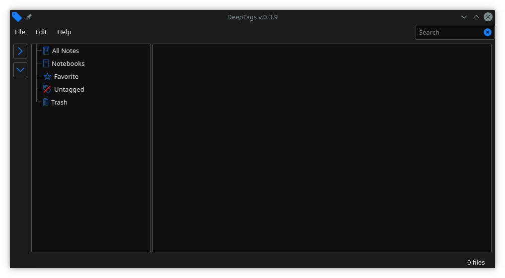
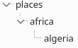

#  DeepTags

[](https://github.com/SZinedine/DeepTags/releases)
[](https://travis-ci.org/SZinedine/DeepTags)
[](https://ci.appveyor.com/project/SZinedine/DeepTags)

**DeepTags** is a Markdown notes manager that organizes notes according to tags.

DeepTags supports nested tags and offers simple ways to edit them, for example by dragging and dropping a tag on a note. These notes could be read either with the integrated editor or with one or multiple third party markdown editors installed on your system. Make sure to add them into the the app in `Edit -> Markdown Readers`




## Features

* **Nested tags**: You can create a hierarchy of tags to organize your notes, in a directory-like structure. For example, the representation of the nested tag: `places/africa/algeria`, would be:

<p align="center">

</p>

* add a tag to a note simply by dragging and dropping it on the file.
* set multiple markdown editors to open your notes with.


## Dependencies

- The Qt framework (>=)5.6
- A C++17 compatible compiler


## Building on Linux

```bash
git clone --recursive https://github.com/SZinedine/DeepTags.git
cd DeepTags
qmake && make
```

## Credit
- [QMarkdownTextEdit](https://github.com/pbek/qmarkdowntextedit) used as an integrated reader.
- The [icon](https://www.iconfinder.com/icons/314740/tag_icon) used in DeepTags is [Yannick Lung's](https://www.iconfinder.com/yanlu), as well as the majority of the icons inside the program.

