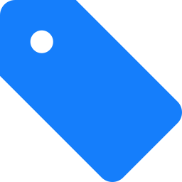

#  DeepTags

[](https://github.com/SZinedine/DeepTags/releases)
[](https://travis-ci.org/SZinedine/DeepTags)
[](https://ci.appveyor.com/project/SZinedine/DeepTags)


**DeepTags** is a Markdown notes manager that organizes notes according to tags. These tags are typically those generated by  [Notable](https://github.com/notable/notable).

Like Notable, DeepTags supports nested tags and offers simple ways to edit them, for example by dragging a tag and dropping it on a file. What it does NOT do, however, is editing the content of the markdown notes. Though you can set your favorite Markdown editor/reader in DeepTags to launch them directly from the app.


* * *
**Note:** DeepTags is tested on Linux. I don't know if it works well on other platforms.

## Why DeepTags

Mainly because I wanted to be able to access quickly one of my notes without launching Notable, or simply add a tag to a file without having to type it out (if it already exists).

## Dependencies

- The Qt framework (>=)5.6
- A C++17 compatible compiler


## Download and compile

```bash
git clone --recursive https://github.com/SZinedine/DeepTags.git
cd DeepTags
qmake && make
```

## Credit
- [Fabio Spampinato](https://github.com/fabiospampinato)'s awesome [app](https://github.com/notable/notable).
- [QMarkdownTextEdit](https://github.com/pbek/qmarkdowntextedit) used as an integrated reader.
- The [icon](https://www.iconfinder.com/icons/314740/tag_icon) used in DeepTags is [Yannick Lung's](https://www.iconfinder.com/yanlu), as well as the majority of the icons inside the program.

