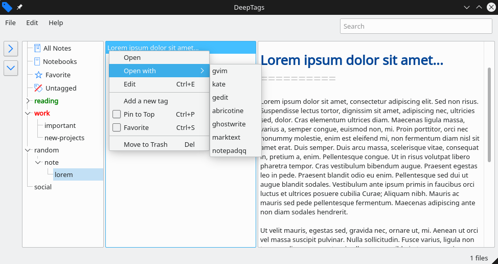

**DeepTags** is a Markdown files browser. It is designed specifically to display files according to the tags found inside them. these tags are typically those generated by [Notable](https://github.com/notable/notable) in yaml format.

What DeepTags does NOT do is opening and editing Markdown files. However, an external program can be easily set in order to open them directly from the program.

**Note:** DeepTags is tested on Linux, there is no guarantee that it would work on another platform.



## Dependencies

- Qt framwork (>=)5.9


## Download and compile

```bash
git clone https://github.com/SZinedine/DeepTags.git
cd DeepTags
qmake && make
```

## credit
- The [icon](https://www.iconfinder.com/icons/314740/tag_icon) is [Yannick Lung's](https://www.iconfinder.com/yanlu).
